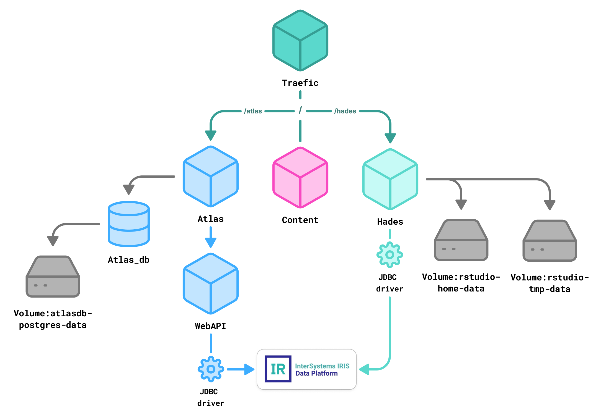
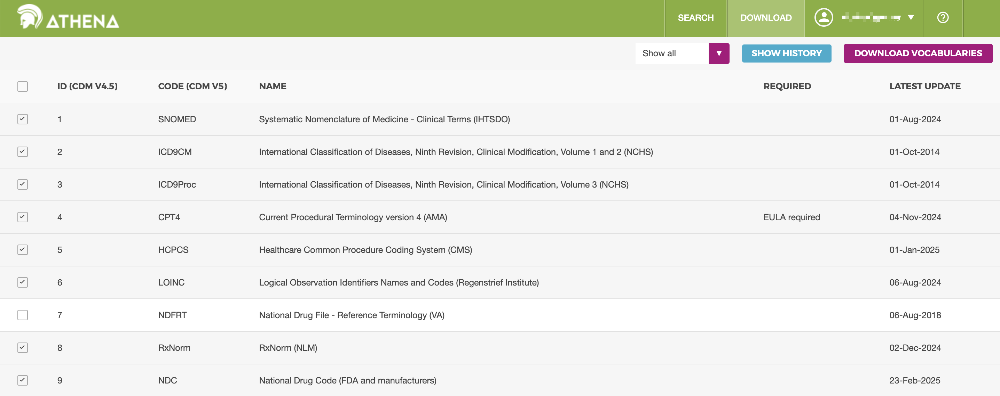

# Instructions for Integrating OHDSI/Broadsea with the InterSystems IRIS Data Platform

## Overview
This guide provides step-by-step instructions for installing __InterSystems IRIS for Health__, deploying the __OHDSI Broadsea__ tool-stack, and connecting the two platforms.
It is intended for engineers and data scientists who need a reproducible setup on __Linux__, __macOS__, or __Windows__ (via Docker).

### Prerequisites
- __Hardware__ — 4 CPU, 8 GB RAM minimum (16 GB recommended)
- __Operating System__ — Linux, macOS, Windows
- __Docker Desktop__ — required for container‑based deployment
- __Git__ — for cloning repositories


## Running InterSystems IRIS for Health, deploying OHDSI Broadsea and connecting to InterSystems IRIS

*Fig. 1. OHDSI Broadsea Deployment Architecture*

This section provides links for the __automated installation__ of the full OHDSI tool-chain (ATLAS, WebAPI, HADES, etc.) using the official [Broadsea repository](https://www.ohdsi.org/wp-content/uploads/2023/10/Londhe-Ajit_Broadsea-3.0-BROADening-the-ohdSEA_2023symposium-Ajit-Londhe.pdf).  
The deployment is preconfigured to integrate with InterSystems IRIS for Health.
After completing the setup, you will have:
* A running __IRIS instance__ with the __Eunomia__ test OMOP CDM and vocabularies preloaded
* __Achilles__ analysis results on the Eunomia dataset, accessible directly in ATLAS
* A configured __RStudio/HADES__ environment ready for analytical workflows

Follow the platform-specific setup instructions:

* [macOS (Apple Silicon)](https://github.com/dwellbrock/ohdsi-iris-macos-env/)
* macOS (Intel) - _in develoment_
* Windows - _in development_

## Loading Data into InterSystems IRIS and Running Analysis

This section describes practical options for loading the OMOP Common Data Model (CDM) into an InterSystems IRIS instance and performing Achilles analyses on it.

### Re-run Achilles on the same dataset in the current result schema
Refreshes the analysis results without changing the schema.

1. Clean up the results schema in IRIS - remove all previously generated tables<br>

    _"OMOPCDM55_RESULTS" - resultSchema for preloaded Achilles analysis results on the Eunomia dataset_<br>
2. Run the commands in RStudio:

```
library(DatabaseConnector)
library(CommonDataModel)

# --- Connection ---
connectionDetails <- DatabaseConnector::createConnectionDetails(dbms = "iris", server = "host.docker.internal", user = "_SYSTEM", password = "_SYSTEM", pathToDriver = "/opt/hades/jdbc_drivers")

cdmSchema     <- "OMOPCDM53"           # preloaded Eunomia test dataset  
resultsSchema <- "OMOPCDM55_RESULTS"   # analysis results on the preloaded Eunomia test dataset 
cdmVersion    <- "5.3"               

# --- Ensure schemas exist, if no - create test table to create schema---
conn <- DatabaseConnector::connect(connectionDetails)
sql <- sprintf("CREATE SCHEMA IF NOT EXISTS %s; CREATE TABLE IF NOT EXISTS %s.test_table (id INT PRIMARY KEY, name VARCHAR(255));", resultsSchema, resultsSchema)
DatabaseConnector::executeSql(conn, sql)
DatabaseConnector::disconnect(conn)

# Create Achilles results tables (empty)
if (!requireNamespace("Achilles", quietly = TRUE)) {remotes::install_github("OHDSI/Achilles")}
library(Achilles)
if ("createResultTables" %in% getNamespaceExports("Achilles")) {
  Achilles::createResultTables(
    connectionDetails       = connectionDetails,
    resultsDatabaseSchema   = resultsSchema
  )
} else {
  Achilles::achilles(
    connectionDetails       = connectionDetails,
    cdmDatabaseSchema       = cdmSchema,
    resultsDatabaseSchema   = resultsSchema,
    vocabDatabaseSchema     = cdmSchema,  
    cdmVersion              = cdmVersion,
    createTable             = TRUE,
    numThreads              = 2,
    smallCellCount          = 0,
    sqlOnly                 = FALSE
  )
}
```

### Re-run Achilles on the same dataset in the new result schema
Useful for comparing results with previous runs.
1. Register InterSystems IRIS as a new data‑source in Postgres (WebAPI)
  * Create a new file named 200_populate_iris_source_daimon.sql and add the following SQL content.<br>
Be sure to replace **%LOGIN%** and **%PASSWORD%** with your actual IRIS credentials:  
 ```
INSERT INTO webapi.source(source_id, source_name, source_key, source_connection, source_dialect)
VALUES (3, 'my-iris-new', 'IRIS', 'jdbc:IRIS://host.docker.internal:1972/USER?user=%LOGIN%&password=%PASSWORD%', 'iris');                         # 'my-iris-new' - name of the new analysis in Atlas
INSERT INTO webapi.source_daimon( source_daimon_id, source_id, daimon_type, table_qualifier, priority) VALUES (7, 3, 0, 'OMOPCDM53', 0);          # preloaded Eunomia test dataset  
INSERT INTO webapi.source_daimon( source_daimon_id, source_id, daimon_type, table_qualifier, priority) VALUES (8, 3, 1, 'OMOPCDM53', 10);         # preloaded Eunomia test dataset  
INSERT INTO webapi.source_daimon( source_daimon_id, source_id, daimon_type, table_qualifier, priority) VALUES (9, 3, 2, 'OMOPCDM53_RESULTS', 0);  # new resultSchema
```
  * Loading 200_populate_iris_source_daimon.sql into the database:
```
docker cp 200_populate_iris_source_daimon.sql broadsea-atlasdb:/docker-entrypoint-initdb.d/200_populate_iris_source_daimon.sql
docker exec -it broadsea-atlasdb psql -U postgres -f "/docker-entrypoint-initdb.d/200_populate_iris_source_daimon.sql"
```
2. Run the same [commands in RStudio](2.-Run-the-commands-in-RStudio) described previously, updating __resultSchema__ beforehand:
```
resultsSchema <- "OMOPCDM53_RESULTS"  # new results schema
```

### Load new data and run analyses
Import new CDM data and updated vocabularies, then run Achilles to generate fresh results.
1. [Register InterSystems IRIS](1.-Register-InterSystems-IRIS-as-a-new-data‑source-in-Postgres-(WebAPI)) as a new data‑source in Postgres (WebAPI) as describe previously, updating __cdmSchema__ and __resultsSchema__
2. Initializing the CDM Schema <br>

   Before any rows can be inserted, the target database must expose the full set of OMOP tables, constraints, and indexes:

```
library(DatabaseConnector)
library(CommonDataModel)

# --- Connection ---
connectionDetails <- DatabaseConnector::createConnectionDetails(dbms = "iris", server = "host.docker.internal", user = "_SYSTEM", password = "_SYSTEM", pathToDriver = "/opt/hades/jdbc_drivers")

cdmSchema     <- "OMOPCDM54"           # name of a new schema  
resultsSchema <- "OMOPCDM54_RESULTS"   # name of a new resultSchema
cdmVersion    <- "5.4"                 # version of your data

# --- Ensure schemas exist, if no - create test table to create schema---
conn <- DatabaseConnector::connect(connectionDetails)
sql <- sprintf("CREATE SCHEMA IF NOT EXISTS %s; CREATE TABLE IF NOT EXISTS %s.test_table (id INT PRIMARY KEY, name VARCHAR(255));", cdmSchema, cdmSchema)
DatabaseConnector::executeSql(conn, sql)
DatabaseConnector::disconnect(conn)

# --- Adaptive call to executeDdl() across package versions ---
fargs <- names(formals(CommonDataModel::executeDdl))
args  <- list(
  connectionDetails   = connectionDetails,
  cdmDatabaseSchema   = cdmSchema,
  cdmVersion          = cdmVersion
)
if ("createIndices" %in% fargs)  args$createIndices  <- TRUE
if ("createIndexes" %in% fargs)  args$createIndexes  <- TRUE
# Some package versions also accept these; harmless if ignored:
if ("createConstraints" %in% fargs) args$createConstraints <- TRUE
if ("createPrimaryKeys" %in% fargs) args$createPrimaryKeys <- TRUE
do.call(CommonDataModel::executeDdl, args)
```

3. Download vocabularies<br>

Depending on your dataset, you may need to download additional vocabularies separately. These can be obtained from the official OMOP vocabulary repository at [https://athena.ohdsi.org](https://athena.ohdsi.org). To do this, register or log in, go to the *“Download”* section (Fig. 4), select the vocabularies relevant to your use case, and generate a download package.

The Community Edition cannot store the full Athena vocabulary set. The following vocabularies are typically sufficient: ICD10CM, ICD9CM, ICD9Proc, CPT4, HCPCS, NDC, RxNorm, RxNorm Extension, SNOMED, LOINC, Visit Type, Drug Type, Procedure Type, Condition Type, Observation Type, Death Type, Note Type, Measurement Type, Device Type, Cohort Type, Gender, Race, Ethnicity, Domain, Relationship, Vocabulary, Concept Class, CDM, Type Concept, UCUM.
Before loading the vocabularies into the database, you need to unzip the vocabulary archive you received from Athena into a convenient directory on your local machine. This directory will be referred to as vocabPath in the code examples below. It should contain CSV files such as CONCEPT.csv, VOCABULARY.csv, RELATIONSHIP.csv, and others. Make sure the path you provide in the code matches the location of the unzipped files.
```
#code here
```

5. Download your data
```
#code here
```

6. Run Achilles:
   
```
# --- Ensure schemas exist, if no - create test table to create schema---
conn <- DatabaseConnector::connect(connectionDetails)
sql <- sprintf("CREATE SCHEMA IF NOT EXISTS %s; CREATE TABLE IF NOT EXISTS %s.test_table (id INT PRIMARY KEY, name VARCHAR(255));", resultsSchema, resultsSchema)
DatabaseConnector::executeSql(conn, sql)
DatabaseConnector::disconnect(conn)

# Create Achilles results tables (empty)
if (!requireNamespace("Achilles", quietly = TRUE)) {remotes::install_github("OHDSI/Achilles")}
library(Achilles)
if ("createResultTables" %in% getNamespaceExports("Achilles")) {
  Achilles::createResultTables(
    connectionDetails       = connectionDetails,
    resultsDatabaseSchema   = resultsSchema
  )
} else {
  Achilles::achilles(
    connectionDetails       = connectionDetails,
    cdmDatabaseSchema       = cdmSchema,
    resultsDatabaseSchema   = resultsSchema,
    vocabDatabaseSchema     = cdmSchema,  
    cdmVersion              = cdmVersion,
    createTable             = TRUE,
    numThreads              = 2,
    smallCellCount          = 0,
    sqlOnly                 = FALSE
  )
}
```
